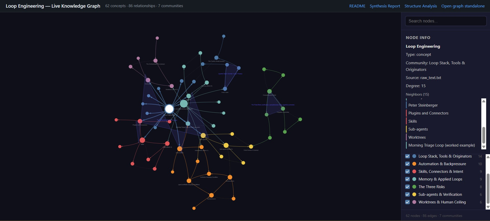

# Loop Engineering — Deep Dive & Knowledge Graph

A grounded synthesis of **Addy Osmani's "Loop Engineering"** — the shift from *prompting* coding agents to *designing the systems that prompt them* — built from the original article and every essay it references, plus an interactive knowledge graph of the whole concept space.

> *"Loop engineering is replacing yourself as the person who prompts the agent. You design the system that does it instead."* — Addy Osmani

### 🔴 [**Explore the live interactive graph →**](https://az9713.github.io/loop-engineering/)

[](https://az9713.github.io/loop-engineering/)

[](https://az9713.github.io/loop-engineering/)

<sub>*The `Loop Engineering` hub (degree 15) selected at center, beside its synthesis twin — the **barbell** waist. Note the green **Three Risks** cluster (right), reachable only through verification, not directly from the hub. [Open the live, interactive version →](https://az9713.github.io/loop-engineering/)*</sub>

*Hosted on GitHub Pages — pan, zoom, drag nodes, explore the seven communities live. (GitHub strips JavaScript from README files, so the interactive version is served from the Pages site linked above; the self-contained source is [`graphify-out/graph.html`](./graphify-out/graph.html).)*

---

## ⭐ Start here — our deep-dive materials

| File | What it is |
|---|---|
| **[Loop-Engineering-Synthesis-Report.md](./Loop-Engineering-Synthesis-Report.md)** | The main deliverable. A fully-cited synthesis grounding the loop-engineering thesis in 12 sources, with a strict quote-fidelity policy (verbatim only where verifiable; everything else paraphrased). |
| **[Graph-Structure-Analysis.md](./Graph-Structure-Analysis.md)** | A structural trace of the graph — the *latent* structure the prose hides: barbell topology, two orthogonal spines, and why the risks sit one hop from the mechanisms. |
| **[Live interactive graph](https://az9713.github.io/loop-engineering/)** | The knowledge graph as a live web page (GitHub Pages). 62 concepts, 86 relationships, 7 thematic communities. |
| **[graphify-out/GRAPH_REPORT.md](./graphify-out/GRAPH_REPORT.md)** | Plain-language audit of the graph: god nodes, surprising cross-document connections, and the questions the graph is uniquely positioned to answer. |
| **[graphify-out/graph.json](./graphify-out/graph.json)** | GraphRAG-ready raw graph data. |

---

## The thesis in one minute

For two years, using a coding agent meant *you* held the tool: type, read, type the next thing. **Loop engineering moves you up one level** — you build a small system that finds work, hands it out, checks it, records state, and decides the next thing, and you let *that* poke the agents instead of you.

Osmani's key observation: this is no longer a tooling problem. The pieces ship inside the products. A loop needs **five building blocks plus a sixth**, and **Claude Code and Codex both have all six now**:

1. **Automations** — the heartbeat (scheduled discovery & triage)
2. **Worktrees** — parallel agents that don't collide
3. **Skills** — project knowledge the agent would otherwise guess (`SKILL.md`)
4. **Plugins & Connectors** — plug into your real tools (built on MCP)
5. **Sub-agents** — split the *maker* from the *checker*
6. **Memory** — state that outlives one conversation (markdown / Linear)

And the caveat that runs through it all: *the loop changes the work; it does not delete you from it.* Three problems get **sharper**, not easier — verification, comprehension debt, and cognitive surrender.

> *"Build the loop. But build it like someone who intends to stay the engineer, not just the person who presses go."*

---

## 🔧 Four applied loop designs (the examples)

The synthesis report includes **four non-trivial, ready-to-apply loop designs**, each exercising all six building blocks and mapped to **both Codex and Claude Code**. They're deliberately different *shapes*:

| Loop | Shape | What makes it distinct |
|---|---|---|
| **A — Nightly dependency & security upgrade** | scheduled batch | strong backpressure (audit + tests); maker/checker split by *security expertise* |
| **B — Flaky-test hunter & quarantine** | reactive, post-CI | **adversarial** checker that doubts the maker's "flaky" classification |
| **C — Incident → postmortem draft** | alert-triggered | **soft** backpressure → mandatory human gate (causation isn't unit-testable) |
| **D — Docs-drift reconciliation** | delta-on-merge | cheapest, most trustworthy backpressure (do the doc examples run?) — the best place to start |

Each design names concrete artifacts for every block: the cadence tool (`/loop`, cron, GitHub Actions, Codex Automations), the named skill, the specific connectors, the sub-agent model split, the worktree usage, the state file, and an explicit verifiable stopping condition. See the report's **§6** for the full tables.

---

## 🕸 The knowledge graph

Built with [graphify](https://github.com/safishamsi/graphify) over the original article **and** the synthesis report, so each of Osmani's concepts links to where the report elaborates it.

**Most connected concepts (god nodes):** `Loop Engineering` · `Skills` · `Automations` · `Sub-agents` · `Worktrees` · `Memory` · `Comprehension Debt`

**Seven communities:** Loop Stack/Tools/Originators · Automation & Backpressure · Skills, Connectors & Intent · Memory & Applied Loops · The Three Risks · Sub-agents & Verification · Worktrees & Human Ceiling

**A question the graph is uniquely positioned to answer:** *Why is `Loop Engineering` the bridge node connecting all six other communities?* (betweenness centrality 0.505 — it is the structural hub of the entire concept space.)

Open `graphify-out/graph.html` to explore it interactively.

---

## 📚 Sources

All materials here are a **synthesis and commentary**; the original works belong to their authors. Osmani's full article text is **not republished** in this repo — it is linked below.

**Primary article**
- Addy Osmani — **Loop Engineering** — https://addyo.substack.com/p/loop-engineering

**Referenced essays** (Addy Osmani, https://addyosmani.com/blog/)
- Agent Harness Engineering — https://addyosmani.com/blog/agent-harness-engineering/
- The Factory Model — https://addyosmani.com/blog/factory-model/
- Long-Running Agents — https://addyosmani.com/blog/long-running-agents/
- The Orchestration Tax — https://addyosmani.com/blog/orchestration-tax/
- Agent Skills — https://addyosmani.com/blog/agent-skills/
- Intent Debt — https://addyosmani.com/blog/intent-debt/
- The Code Agent Orchestra — https://addyosmani.com/blog/code-agent-orchestra/
- AI writes code faster. Your job is still to prove it works. — https://addyosmani.com/blog/code-review-ai/
- Comprehension Debt — https://addyosmani.com/blog/comprehension-debt/
- Cognitive Surrender — https://addyosmani.com/blog/cognitive-surrender/

**Raised in the article's comments**
- Bilgin Ibryam (*The Generative Programmer*) — **Stop Babysitting Your Coding Agent** — https://generativeprogrammer.com/p/stop-babysitting-your-coding-agent

> **Source notes.** Direct quotes in the synthesis report are reproduced only from primary text that could be verified (the *Loop Engineering* article and the re-confirmed *Long-Running Agents* / *Orchestration Tax* lines); all other source claims are paraphrased. The slug `addyosmani.com/blog/adversarial-code-review/` returns a 404 — that material actually lives inside the *Loop Engineering* article and is cited there, not as a separate source.

---

## Repository contents

```
.
├── README.md                              # you are here
├── index.html                             # GitHub Pages entry → renders the live graph
├── Loop-Engineering-Synthesis-Report.md   # the deep-dive report (main deliverable)
├── Graph-Structure-Analysis.md            # latent-structure trace of the graph
└── graphify-out/
    ├── graph.html                         # interactive knowledge graph (self-contained)
    ├── graph.json                         # GraphRAG-ready graph data
    └── GRAPH_REPORT.md                    # graph audit (god nodes, bridges, questions)
```

*The original article (saved `.mhtml` and extracted `raw_text.txt`) is kept locally but excluded from the repo via `.gitignore` — see Sources above for the canonical link.*

---

*Synthesis assembled with Claude Code. The knowledge graph was built with [graphify](https://github.com/safishamsi/graphify).*
